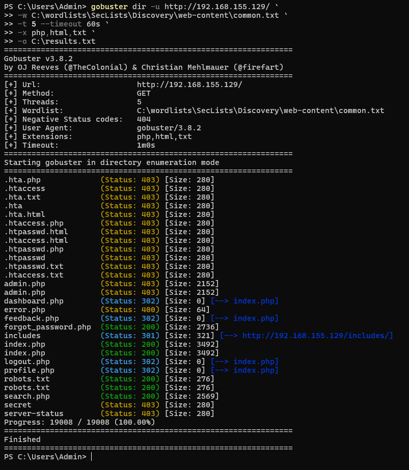
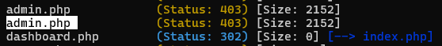
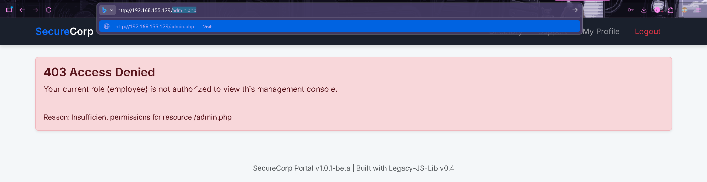
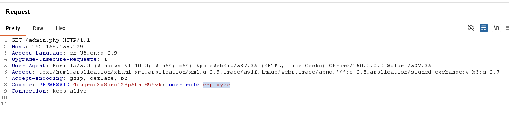
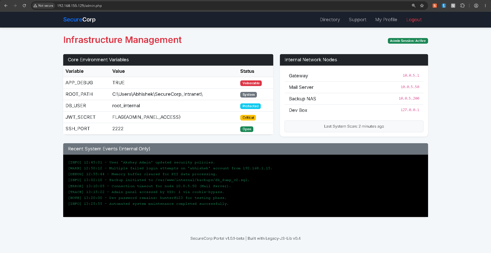
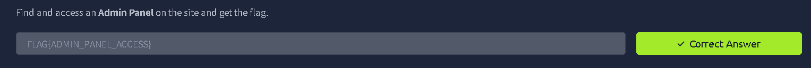

# Task 7 — Admin Panel (Broken Access Control)

**Platform:** TryHackMe — [tutedude-cybersec](https://tryhackme.com/jr/tutedude-cybersec)
**Category:** Broken Access Control · OWASP A01:2021 · CWE-639
**Flag:** `FLAG{ADMIN_PANEL_ACCESS}`

## 🎯 Objective

Locate and access the admin panel on the SecureCorp Portal by exploiting an access-control flaw — specifically, session/cookie manipulation. Picks up from a prior task where creds for a low-priv account (`john`) were pulled from the client-side source.

## 🛠 Tools

- Gobuster v3.8.2
- Burp Suite (Proxy / Repeater)
- Browser + DevTools

## 📝 Walkthrough

### 1. Directory enumeration

```
gobuster dir -u http://192.168.155.129/ \
  -w C:\wordlists\SecLists\Discovery\web-content\common.txt \
  -t 5 --timeout 60s \
  -x php,html,txt \
  -o C:\results.txt
```

`admin.php` comes back `403` (page exists, access blocked) while `dashboard.php` returns a `302` redirect — sign of an active role gate.




### 2. Confirm the check

Logged in as `john`, a direct hit on `/admin.php` gets rejected in-app: *"Your current role (employee) is not authorized..."* — so the check is real, and application-level.



### 3. Intercept with Burp

The role turns out to live in a plain, editable cookie — not the server-side session:

```
Cookie: PHPSESSID=4ougrdo3o8qro128p6tni899vk; user_role=employee
```



### 4. Tamper & forward

Flip `user_role` → `admin`, keep the path at `/admin.php`, forward. Admin dashboard loads, no further auth needed.



### 5. Flag

`JWT_SECRET` in the leaked env table = the flag. Submitted on TryHackMe ✅



## 🔍 Root Cause

Authorization is decided from a client-controlled cookie (`user_role`) instead of the authenticated server-side session — the trust boundary sits in the wrong place, so any client can self-assign a role by editing a header.

## 💥 Impact

- Full admin panel takeover via one cookie edit — no exploit chain needed
- `JWT_SECRET`, DB username, and filesystem root path exposed
- Internal network topology leaked (gateway / mail / backup / dev IPs)
- Plaintext dev credential sitting in the system log
- App logs the bypass (`cookie-bypass` trace) but never blocks it — detection without enforcement

## 🔒 Fix

1. Resolve role server-side from the session on every request — never trust a client-supplied cookie/header for authz
2. If a client-visible token is needed, sign + verify it server-side (proper JWT) instead of shipping a raw editable value
3. Centralize authorization middleware on all `/admin*` routes
4. Strip env vars / secrets / internal IPs out of any UI, admin included
5. Turn the existing bypass detection into an active alert + session kill, not just a log line
6. Rotate anything that ever touched a log file

## 📁 Contents

```
CyberSecurity-Task-AdminPanel-Farhan/
├── README.md                    # this file
├── Admin-Panel-Report.docx      # full write-up, screenshots embedded
└── screenshots/                 # raw evidence, chronological order
    ├── 01-gobuster-directory-enum.png
    ├── 02-admin-dashboard-status-codes.png
    ├── 03-403-access-denied.png
    ├── 04-burp-request-cookie-role.png
    ├── 05-admin-panel-flag-captured.png
    └── 06-thm-correct-answer.png
```
