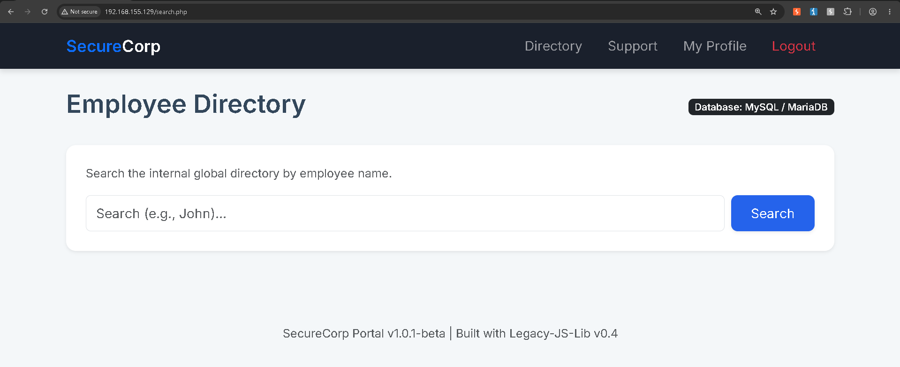
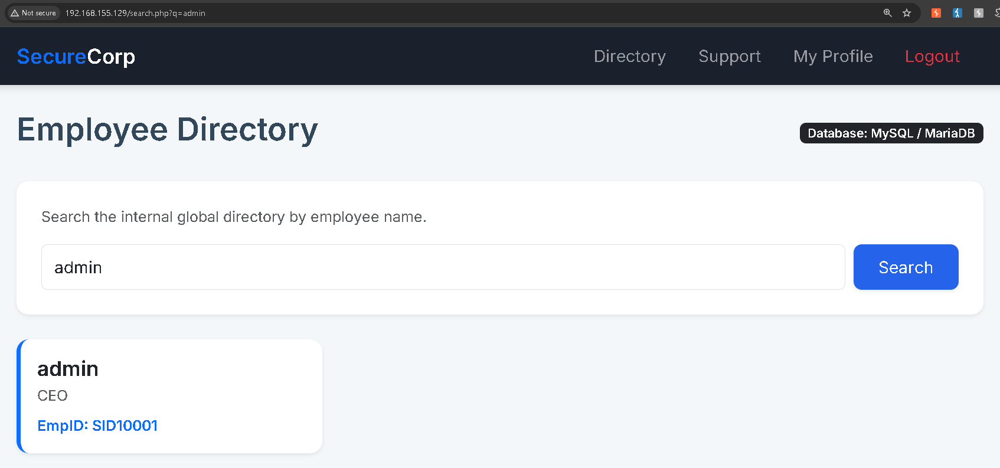
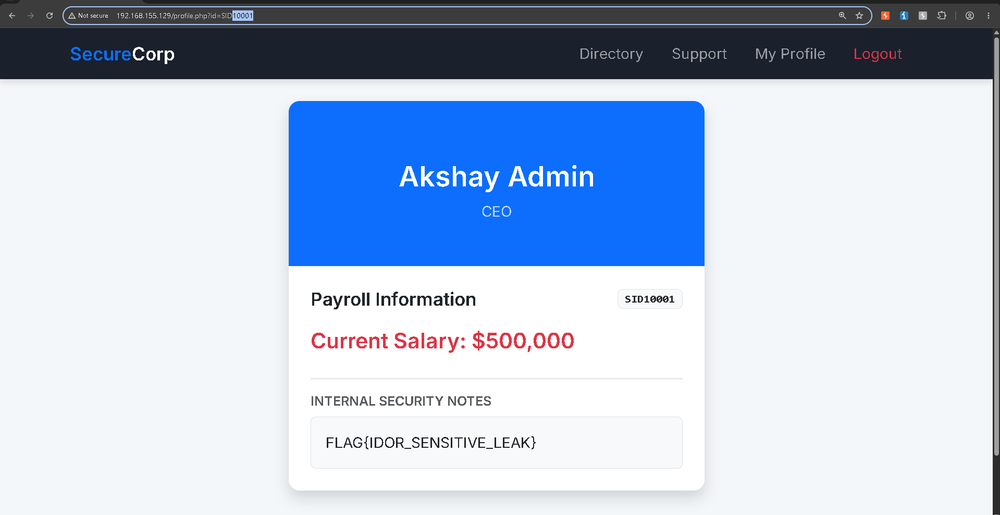

# CyberSecurity Task 8 — IDOR (Insecure Direct Object Reference)

| | |
|---|---|
| **Student** | Farhan |
| **Institution** | Bhagwan Mahavir University (BMU), Surat |
| **Platform** | TryHackMe |
| **Room** | [tutedude-cybersec](https://tryhackme.com/jr/tutedude-cybersec) |
| **Target App** | SecureCorp Portal (`192.168.155.129`) |
| **Vulnerability Class** | IDOR — Insecure Direct Object Reference |
| **CWE** | CWE-639: Authorization Bypass Through User-Controlled Key |
| **OWASP Category** | A01:2021 – Broken Access Control |
| **Flag** | `FLAG{IDOR_SENSITIVE_LEAK}` |

## Objective

Identify an access control (IDOR) flaw in the profile page of the SecureCorp portal, use it to view the admin's profile page, and capture the flag.

## Summary

The SecureCorp portal identifies which employee's profile to render using a client-supplied `id` query parameter (`profile.php?id=<EmpID>`), with no server-side check that the requesting session is authorized to view that record. Combined with an employee directory search that leaks other users' EmpIDs — including the admin's — a low-privilege user can pivot straight to the admin's profile just by editing the URL, exposing payroll data and an internal security note containing the flag.

## Steps

1. **Credential discovery** — Checked the client-side source code of the login page (view-source) and recovered valid login credentials, as hinted in the task brief.
2. **Authenticated directory search** — Logged in and opened the **Directory** tab (`search.php`), an internal employee search facility.
   
3. **Enumerating the admin account** — Searched the directory for `admin`. The result card exposed the admin's job title (CEO) and, critically, their internal **EmpID: `SID10001`**.
   
4. **IDOR exploitation via URL tampering** — On my own **My Profile** page, the URL followed the pattern `profile.php?id=<MyEmpID>`. I replaced my own EmpID in the URL with the admin's EmpID (`SID10001`) found in step 3. The server returned the admin's ("Akshay Admin") full profile with no authorization check — including **Payroll Information** (`Current Salary: $500,000`) and an **Internal Security Notes** panel containing the flag.
   
5. **Flag capture** — Submitted the flag on the TryHackMe room.
   

## Root Cause Analysis

- **Sensitive identifier disclosure** — The directory search returns each employee's EmpID in plain, copyable text, including for privileged accounts. This hands an attacker the exact "key" needed to target another user's data — if the admin's EmpID weren't surfaced here, the IDOR would be significantly harder to exploit.
- **Client-controlled object reference** — `profile.php` decides *whose* data to render purely from a client-supplied `id` parameter in the URL, with no indirection (session-bound token, opaque reference) tying the request back to the logged-in user.
- **Missing server-side authorization** — The backend never verifies that the requested EmpID belongs to (or is permitted for) the current session before returning the record.
- **Client-side checks aren't a fix** — Even if a check existed only in JavaScript, it would be trivially bypassable by replaying the request through Burp Suite's Repeater, since the server itself doesn't enforce ownership.

## Impact

Any authenticated employee, regardless of privilege level, can view another employee's full profile — including salary and internal security notes — by supplying their EmpID. Because EmpIDs follow a predictable sequential format (`SID#####`), an attacker could enumerate the entire employee database by iterating the ID directly, without even relying on the directory search feature.

## Remediation Recommendations

1. Enforce **server-side authorization** on `profile.php` and every similar endpoint: confirm the session user matches the requested record, or holds an explicit admin/HR role, before returning another user's data.
2. Avoid exposing internal identifiers in a guessable/sequential format on client-visible surfaces. Resolve "My Profile" from the session itself rather than a client-supplied ID, or use non-sequential opaque identifiers.
3. Restrict the fields returned by directory search (e.g. name and title only); don't surface an identifier that's also used as an authorization key elsewhere.
4. Apply authorization checks consistently across UI and API — never rely on a client-side control alone.
5. Add logging / rate-limiting for repeated or sequential profile-ID access attempts to catch enumeration in progress.

## Conclusion

This exercise demonstrates a textbook Broken Access Control (IDOR) vulnerability caused by the combination of a disclosed, predictable identifier and the total absence of a server-side ownership check. It's a good reminder that access control has to be enforced on every request, server-side, regardless of what the UI does or doesn't show.

## Contents

```
CyberSecurity-Task-IDOR-Farhan/
├── README.md                          # this file
├── IDOR-Report-Farhan.docx            # full report with embedded screenshots (submission doc)
└── screenshots/
    ├── 01-employee-directory-search.png
    ├── 02-admin-empid-found.png
    ├── 03-idor-admin-profile-flag.png
    └── 04-flag-correct-answer.png
```
